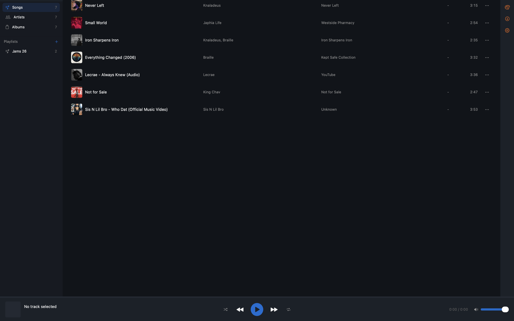
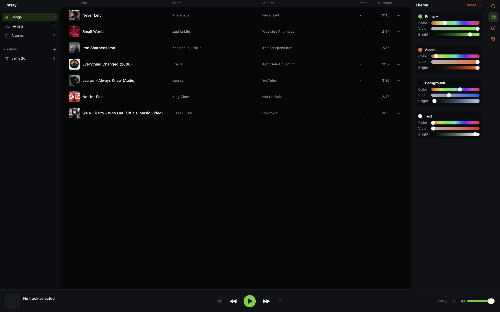
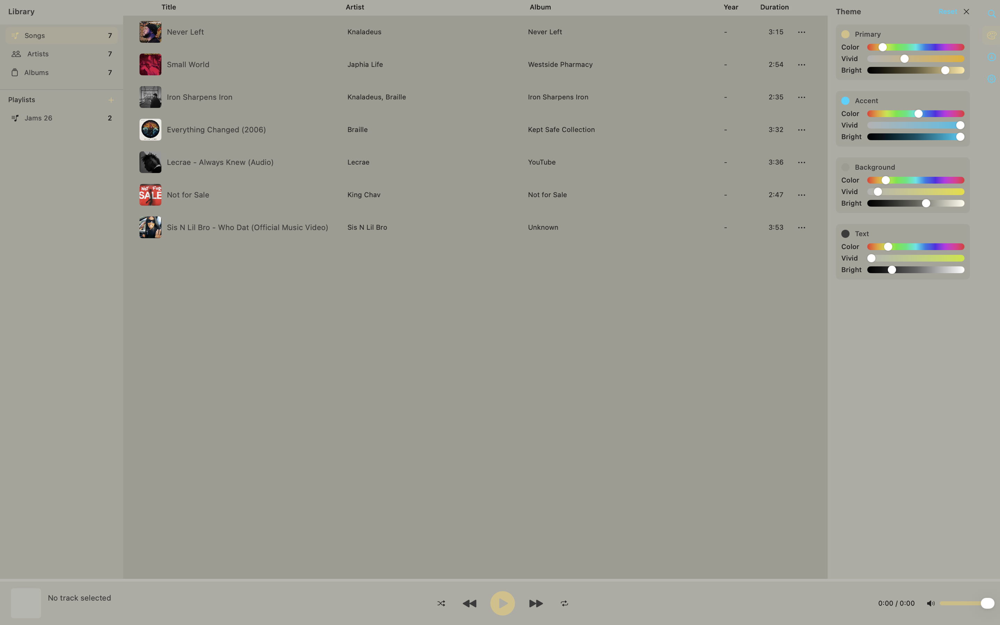
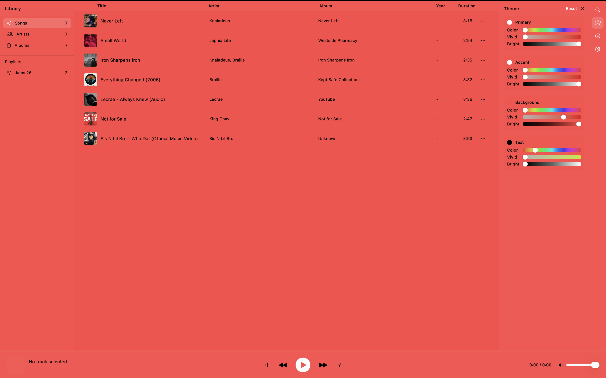
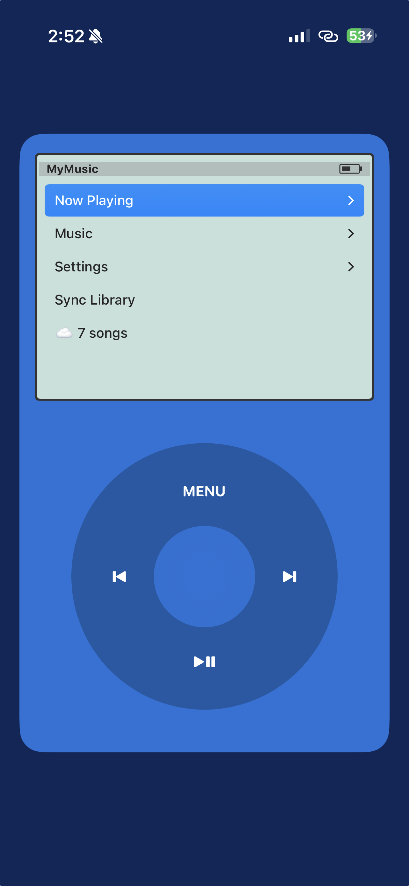
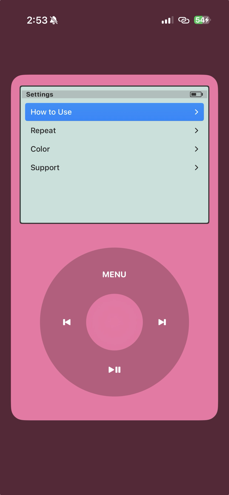
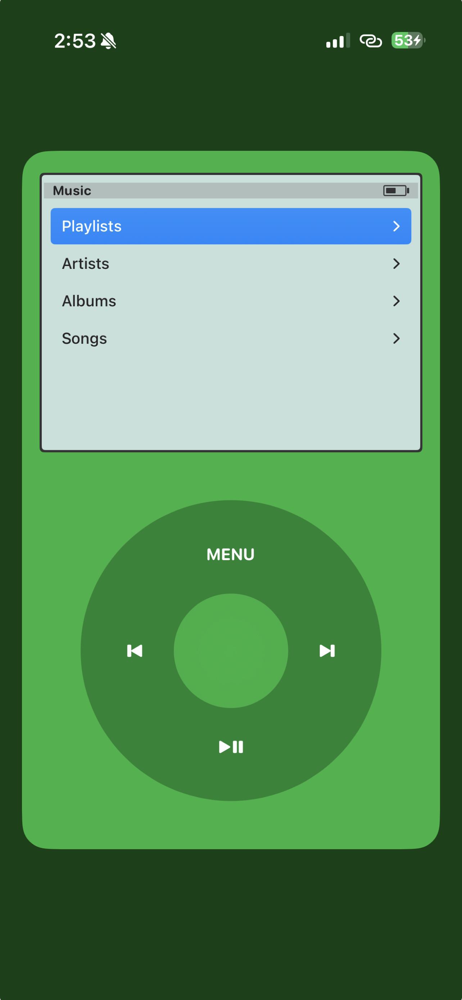

# Music in 2001

Your music. Your library.

A music player that brings back the simplicity of 2001 - when you owned your music, synced it from your computer, and listened on your terms.

## Download

| Version | Description | Link |
|---------|-------------|------|
| **Direct Download** | Full experience with YouTube downloads | [Download .dmg](https://github.com/okekedev/MusicIn2001/releases/latest) |
| **Mac App Store** | Official Release | [App Store](#) |
| **iOS App** | Official Release | [App Store](#) |

## Screenshots

### Mac App

<p align="left">
  
  
</p>
<p align="left">
  
  
</p>

### iOS App

<p align="left">
  
  
  
  
</p>

## Features

### Mac App
- **YouTube Downloads** - Paste a URL and add it to your library (Direct Download version only)
- Import MP3 files directly
- Organize your library by artist, album, and genre
- Custom themes with full color customization
- Create playlists
- Sync to iCloud for your iOS device

### iOS App
- Classic iPod-inspired click wheel interface
- 7 iconic iPod colors to choose from
- Browse by artists, albums, songs, or playlists
- Background playback with lock screen controls
- Syncs automatically from your Mac library

## How It Works

1. Download Music in 2001 on your Mac
2. Add songs (MP3 files or paste a YouTube link)
3. Open Music in 2001 on your iPhone
4. Tap Sync - your library appears

## Requirements

- macOS 13.0+
- iOS 17.0+
- iCloud account (for syncing between devices)

## Build from Source

```bash
# Clone the repository
git clone https://github.com/okekedev/MusicIn2001.git
cd MusicIn2001

# Open in Xcode
open Music2001.xcodeproj

# Build and run (Cmd + R)
```

### Build Configurations

- **App Store Build**: Uses `Music2001.entitlements` (sandboxed, no YouTube downloads)
- **Direct Download Build**: Uses `Music2001Direct.entitlements` (non-sandboxed, YouTube downloads enabled)

## Links

- [Website](https://okekedev.github.io/MusicIn2001)
- [Privacy Policy](https://okekedev.github.io/MusicIn2001/privacy-policy)
- [Terms of Use](https://okekedev.github.io/MusicIn2001/terms-of-use)
- [Support](https://okekedev.github.io/MusicIn2001/support)

## License

Copyright 2024 Christian Okeke. All rights reserved.
