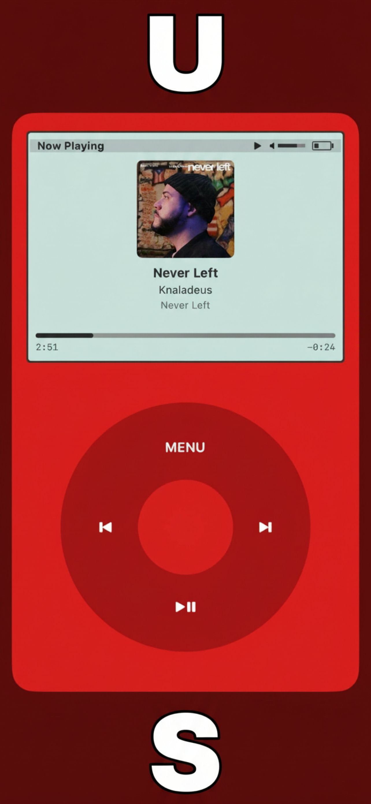

# MyMusic - 2001

Your music. Your library.

A music player that brings back the simplicity of 2001 - when you owned your music, synced it from your computer, and listened on your terms.

## Screenshots

  
  
  

## Features

### Mac App
- Import MP3s or download from links
- Organize your library by artist, album, and genre
- Create playlists
- DJ-style mixer with dual decks, crossfader, and 5-band EQ
- Sync to iCloud for your iOS device

### iOS App
- Classic iPod-inspired click wheel interface
- Browse by artists, albums, songs, genres, or playlists
- Background playback with lock screen controls
- Syncs automatically from your Mac library

## How It Works

1. Download MyMusic on your Mac
2. Add songs (MP3 files or paste a link)
3. Open MyMusic on your iPhone
4. Tap Sync - your library appears

## Requirements

- macOS 13.0+
- iOS 17.0+
- iCloud account (for syncing between devices)

## Links

- [Privacy Policy](https://okekedev.github.io/MusicIn2001/privacy-policy)
- [Terms of Use](https://okekedev.github.io/MusicIn2001/terms-of-use)
- [Support](https://okekedev.github.io/MusicIn2001/support)

## License

Copyright 2024 Christian Okeke. All rights reserved.
