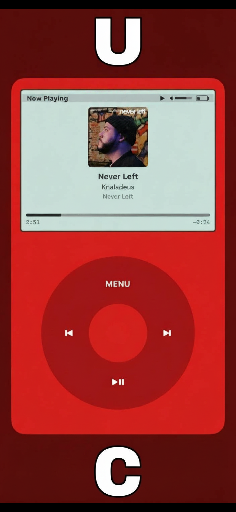
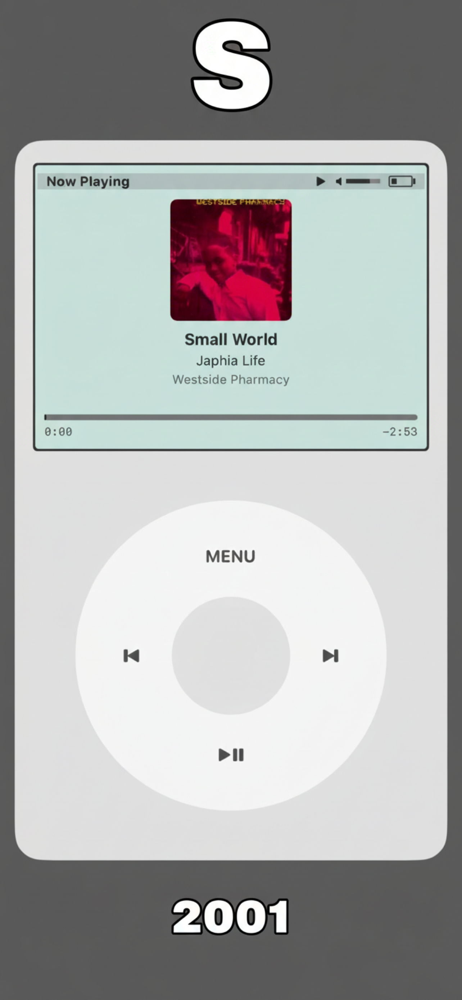

# Music in 2001

Your music. Your library.

A music player that brings back the simplicity of 2001 - when you owned your music, synced it from your computer, and listened on your terms.

## Screenshots

<p align="left">
  
  
  
</p>

## Features

### Mac App
- **Download songs from any link** - paste a URL and add it to your library
- Import MP3 files directly
- Organize your library by artist, album, and genre
- Create playlists
- Sync to iCloud for your iOS device

### iOS App
- Classic iPod-inspired click wheel interface
- Browse by artists, albums, songs, genres, or playlists
- Background playback with lock screen controls
- Syncs automatically from your Mac library

## How It Works

1. Download Music in 2001 on your Mac
2. Add songs (MP3 files or paste a link)
3. Open Music in 2001 on your iPhone
4. Tap Sync - your library appears

## Requirements

- macOS 13.0+
- iOS 17.0+
- iCloud account (for syncing between devices)

## Build from Source

```bash
# Clone the repository
git clone https://github.com/okekedev/MusicIn2001.git
cd MusicIn2001

# Open in Xcode
open Music2001.xcodeproj

# Build and run (Cmd + R)
```

### Prerequisites

For the download feature to work, install these via Homebrew:

```bash
brew install yt-dlp ffmpeg
```

## Links

- [Privacy Policy](https://okekedev.github.io/MusicIn2001/privacy-policy)
- [Terms of Use](https://okekedev.github.io/MusicIn2001/terms-of-use)
- [Support](https://okekedev.github.io/MusicIn2001/support)

## License

Copyright 2024 Christian Okeke. All rights reserved.
